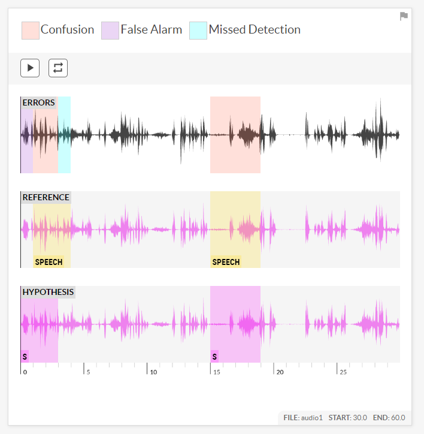

# Annotating your own data with 💥 Prodigy

Manually segmenting and labeling audio data is time consuming.  For speaker diarization, depending on the required level of precision, it may take more than 10 times the duration of a recording to annotate it.

## Table of content

* [Recipes](#recipes)
* [Keyboard shortcuts](#keyboard-shortcuts)

## Recipes

`pyannote.audio` comes with a bunch of [💥 Prodigy](https://prodi.gy) recipes designed to speed things up a bit.

|   Recipe              | Usage                                                 |
|-----------------------|-------------------------------------------------------|
 🦻 `pyannote.audio`    | Annotate with a [pretrained pipeline](https://huggingface.co/models?other=pyannote-audio-pipeline) in the loop
 🧐 `pyannote.review`   | Merge multiple annotations
 🤲 `pyannote.diff`     | Show differences between two annotations
 🗄 `pyannote.database` | Dump annotations as [`pyannote.database`](https://github.com/pyannote/pyannote-database/) protocols

### 🦻 `pyannote.audio` | Annotate with a pretrained pipeline in the loop

```bash
prodigy pyannote.audio dataset /path/to/audio/directory pyannote/speaker-segmentation
```


`pyannote.audio` recipe will stream in `.wav` files in chunks and apply [a pretrained pipeline](https://huggingface.co/models?other=pyannote-audio-pipeline). You can then adjust the regions manually if needed.


<details>
<summary>More options</summary>

```
prodigy pyannote.audio [options] dataset source pipeline

  dataset           Prodigy dataset to save annotations to.
  source            Path to directory containing audio files to annotate.
  pipeline          Name of pretrained pipeline on huggingface.co (e.g.
                    pyannote/speaker-segmentation) or path to local YAML file.
  -chunk DURATION   Split audio files into shorter chunks of that many seconds.
                    Defaults to 10s.
  -precision STEP   Temporal precision of keyboard controls, in milliseconds.
                    Defaults to 200ms.
  -beep             Produce a beep when the player reaches the end of a region.
```

</details>


### 🧐 `pyannote.review` | Merge multiple annotations

```bash
prodigy pyannote.review dataset /path/to/audio/directory input1.rttm,input2.rttm
```


`pyannote.review` recipe take as many annotation files, using the RTTM file format, as you want and let you compare and choose which ones are best within the same stream as `pyannote.audio` recipe.
Click on a segment of the annotation files to add it to the ouput audio, or on "Input X" to add all segments at once.

<details>
<summary>More options</summary>

```
prodigy pyannote.review [options] dataset source annotations

  dataset           Prodigy dataset to save annotations to.
  source            Path to directory containing audio files whose annotation is to be checked.
  annotations       Comma-separated paths to annotation files.
  -chunk DURATION   Split audio files into shorter chunks of that many seconds.
                    Defaults to 30s.
  -diarization      Make a optimal one-to-one mapping between the first annotation and the others.
  -precision STEP   Temporal precision of keyboard controls, in milliseconds.
                    Defaults to 200ms.
  -beep             Produce a beep when the player reaches the end of a region.
```

</details>


### 🤲 `pyannote.diff` | Show differences between two annotations

```bash
prodigy pyannote.diff dataset /path/to/audio/directory /path/to/reference.rttm /path/to/hypothesis.rttm
```



`pyannote.diff` recipe take one reference file and one hypothesis file, using the RTTM file format, and focus where there are the most errors among missed detections, false alarms and confusions.
You can filter on one or more error types and their minimum duration with the corresponding options.


<details>
<summary>More options</summary>

```
prodigy pyannote.diff [options] dataset source reference hypothesis

  dataset                    Prodigy dataset to save annotations to.
  source                     Path to directory containing audio files whose annotation is to be checked.
  reference                  Path to reference file.
  hypothesis                 Path to hypothesis file.
  -chunk DURATION            Split audio files into shorter chunks of that many seconds.
                             Defaults to 30s.
  -min-duration DURATION     Minimum duration of errors in ms.
                             Defaults to 200ms.
  -diarization               Make a optimal one-to-one mapping between reference and hypothesis.
  -false-alarm               Display false alarm errors.
  -speaker-confusion         Display confusion errors.
  -missed-detection          Display missed detection errors.
```

</details>

### 🗄 `pyannote.database` | Dump annotations as `pyannote.database` protocols

Work in progress


## Keyboard shortcuts

Though `pyannote.audio` recipes are built on top of the Prodigy [audio interface](https://prodi.gy/docs/api-interfaces#audio), they provide a bunch of handy additional keyboard shortcuts.

| Shortcut                          | Description                                      |
|-----------------------------------|--------------------------------------------------|
|  `left` / `right` (+ `w`)         | Shift player cursor (speed up)                   |
|  `up` / `down`                    | Switch active region                             |
|  `shift + left` / `shift + right` | Shift active region start time                   |
|  `ctrl + left` / `ctrl + right`   | Shift active region end time                     |
|  `shift + up`                     | Create a new region                              |
|  `shift + down` / `backspace`     | Remove active region                             |
|  `spacebar`                       | Play/pause player                                |
|  `escape`                         | Ignore this sample                               |
|  `enter`                          | Validate annotation                              |


## RTTM file format

RTTM files contain one line per speech turn, using the following convention:

```bash
SPEAKER {uri} 1 {start_time} {duration} <NA> <NA> {speaker_id} <NA> <NA>
```
* uri: file identifier (as given by pyannote.database protocols)
* start_time: speech turn start time in seconds
* duration: speech turn duration in seconds
* confidence: confidence score (can be anything, not used for now)
* gender: speaker gender (can be anything, not used for now)
* speaker_id: speaker identifier
